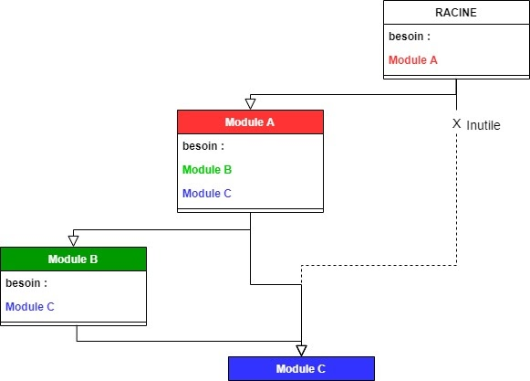

# Projet Tutoré - La vache est dans le pré

## Informations générales


### Membres

* [Julien Mocquet](https://gitlab.com/Jujugibus) - G3
* [Julien Mocquet](https://gitlab.com/Jujugibus) - G3
### Dépôt Git
[https://gitlab.com/TheoGicquel/la-noiraude-bot](https://gitlab.com/TheoGicquel/la-noiraude-bot)


## Mise en place

Le projet n'est non pas compilé mais est exécuté au sein d'une instance NodeJS, un Runtime ( ou exécutif) qui permet d'exécuter du Javascript côté serveur ( plus d'informations dans le paragraphe dédié )

###  1 - Prérequis 

* Disposer de [Nodejs](https://nodejs.org/en/download/) (Si vous utilisez windows 7, la version 14.16.0 car dernière version supportée par cet OS )

### 2 - Installation des dépendances

Dans un terminal pointant sur la racine du projet :

```bash
npm install
```

Cela installera toutes les dépendances nécessaires au projet 

### 3 - Démarrage

Dans le même emplacement, effectuez la commande suivante pour démarrer l'instance locale de NodeJS

```bash
npm run start
```

### 4 - Accès à l'interface

Puisque le projet est un robot utilisant l'API et la plateforme de discussion Discord ,il est nécessaire de se rendre sur un serveur disposant du robot.

Vous avez donc à disposition le lien suivant d'accès à un serveur préparé à l'avance pour l'occasion, Le pré de la Noiraude :

https://discord.gg/b6hJTTAMp2

## Explications

Le cœur du projet consiste en la création d’un module NodeJS utilisant ses propres sous modules effectuant les opérations nécessaires (calcul, formatage, saisie etc..)

Ces modules sont  appelés via l’interface de programmation d'application (API) fournie par discord

### NodeJS

NodeJS est un runtime évenementiel à file d’exécution unique créé en 2009 par [Ryan Dahl, son](https://en.wikipedia.org/wiki/Ryan_Dahl) fonctionnement repose sur du javascript, plus particulièrement sur une instance externe à un navigateur du moteur d’exécution [V8](https://en.wikipedia.org/wiki/V8_(JavaScript_engine)) (réalisé par le projet chromium).

### Fonctionnement interne
Le point d’entrée d’exécution de l’application est situé dans le fichier `/index.js`, ce script effectue l’initialisation du robot discord et effectue l’importation de tous les modules situés dans le répertoire `/commands` 

### Gestion des modules
Un aspect pouvant être déroutant, est la façon dont les modules sont gérés au sein de nodeJS. 

En effet, tout module nécessitant un sous module doit le définir explicitement avec `require()`, cependant, les parents de ce même module n’ont besoin que d'appeler leurs modules étant directement enfants, ce qui permet de grandement faciliter la lecture du code et bien évidemment, de pouvoir gérer les modules de manière indépendante les uns des autres.



Utiliser des modules dispose également d’un autre intérêt :

Toutes les structures de données exposées par un module sont accessibles par tous les modules parents utilisant ce même module.

Le meilleur exemple pour illustrer cela est le module situé dans `/libs/noiraude.js` qui stocke toutes les informations relative à l'enclos de la vache.

## Conclusion

### intérêt du projet

Ce projet nous a permis d'améliorer nos compétences en javascript, et par la même occasion d'apprendre à utiliser NodeJS dans un cadre de projet/

Concernant la gestion de projet en elle même, travailler sur un projet d'une telle taille a renforcé nos compétences a travailler en "équipe" dans un environnement git, et nous a permis de découvrir la fonctionnalité de "Releases" proposé par gitlab.

### Difficultés

Ce projet étant notre première expérience avec NodeJS, il a été assez difficile dans un premier temps de comprendre la façon dont les modules interagissaient entre eux.

Les mathématiques nous ont posé une certaine difficulté, cependant, le fait d’utiliser du Javascript nous a grandement facilité la tâche en termes d’allocation mémoire et calcul.

### Axes d’amélioration

- Meilleure gestion des exceptions et messages d’erreur
- Optimisation des performances
- Importation directe de la saisie de l’enclos via un fichier JSON ou autre envoyé au robot via discord
- Affichage de l’enclos sous forme d’image générée automatiquement
